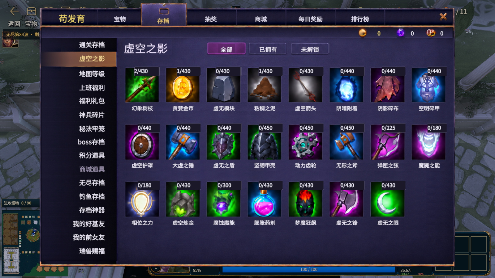

# 虚空之影 V1 验收

本轮只接入「存档 → 虚空之影」，保留现有存档数据接口、游戏业务逻辑和 Tooltip。第一版已在真实游戏的 1600×900 窗口运行，等待查看后再调整。



主图来自前台游戏窗口的实际组装页面，不是附件参考图或浏览器稿。已实际点击并核对全部 23 项、已拥有 3 项、未解锁 20 项、悬停详情、切回通关存档及关闭重开。重新从顶部打开存档仍沿用原来的默认分类，再选择「虚空之影」即可。

[实机截图合集](Review.html) 包含全部、已拥有、未解锁、Tooltip 和关闭重开状态；[验收来源记录](ACCEPTANCE.json) 保存截图 SHA、来源、时间和源码编译核对。`../work/native` 中早期后台截图存在缓存画面，未作为状态切换通过的证据。

## 本版内容

- 原样使用附件 `assets` 的 38 张正式 PNG：4 张背景、11 个公共组件、23 个图标。原图 RGBA 与 SHA 保持一致，带字参考切片没有接入正式 UI。
- 以 1672×941 为统一坐标，整个画布居中等比缩放。23 个条目按 8＋8＋7 显示，每项只有图标、右上角数量和下方名称。数量牌保持右侧锚点，向左加宽并完整覆盖原图缺口。
- 名称、数量、分类和余额为独立文本。真实配置提供名称、上限和说明；持有数及资源余额来自原接口，预览样例不写入真实存档。
- 已知数量大于 0 才算已拥有，已知 0 才算未解锁；未知为「—」。有真实上限则显示「数量/上限」。完整成功快照的缺失持有项才补为 0，分包尚未完成不补 0；未来新增条目不会被 23 截断。
- 复用包内思源黑体 Regular：它与工程已有引擎字体原字节一致，继续使用已注册字体，不额外安装或更换系统字体。

## 与参考图的差异和验证范围

正式内容采用项目真实数据。例如「虚无模块」「大虚之锤」等名称及 430、440 等真实上限，与附件预览名称和分母不同；资源余额也不会固定为参考图数字。具体对应见 [数据审查](../work/DataAudit.md)。

弹窗外侧是实时战场，未把包内场景参考图覆盖到游戏背景。效果和条件继续使用项目原 Tooltip，因此详情外观保留现有实现。原生字体栅格化与附件预览、浏览器渲染有可见字重差异，供本轮实机截图验收。

真实游戏已验证的画布尺寸为 1600×900。1672×941、1280×720，以及未知数、零库存、无上限、超长数字与名称、24 条目、稀疏库存、空库存、分包组装、资源事件刷新等边界，已通过本地组件预览测试，尚未逐项在游戏内构造验证。浏览器以实际 XML、JS、CSS 组装，Panorama 布局与 `text-overflow: shrink` 由适配器近似，不将浏览器结果当作原生逐像素验证。

## 文件与运行入口

[修改文件清单](CHANGE_LIST.md) 按用途归组；[详细文件与 SHA](CHANGE_LIST.json) 包含 6 个生产源码、38 个 PNG 及 44 个编译产物。素材和字体接入记录见 [AssetsAndFont.md](AssetsAndFont.md)。

游戏内直接打开「存档 → 虚空之影」。本页编译产物已经部署。需要重新编译时，在项目根目录运行：

```powershell
powershell -NoProfile -ExecutionPolicy Bypass -File tools/void_shadow_v1/compile.ps1
```

本地预览不连接账号、支付、游戏服务或保存接口。在项目根目录运行：

```powershell
node tools/void_shadow_v1/preview.cjs
Start-Process 'design_refs/void_shadow_v1/work/preview/index.html'
```

预览页支持 `?state=normal`、`?state=edges`、`?state=loading`、`?state=sparse`、`?state=empty`、`?state=extra`、`?state=chunked`。量值均为明确的本地样例。自动截图和边界检查需要 Node.js 及当前工具配置的 Chrome：

```powershell
node tools/void_shadow_v1/capture.cjs --sizes 1672x941,1600x900,1280x720 --out design_refs/void_shadow_v1/work/browser_v1
```

已保存 [浏览器对比](../work/BrowserReview.html) 与 [测试报告](../work/browser_v1/report.json)。

## 恢复入口

本轮接入前的两个既有源码已保存在 `../work/checkpoint/source/panorama/src/`：`layout/custom_game/archive.xml` 和 `scripts/custom_game/archive_180de7e38b_titles_compact_v6.js`。回退此页时先对照当前差异，再只恢复这两个接入点并重新编译它们；不得覆盖任务后其他人新增的改动，也不需要重置整个仓库。

已验收的 V1 源码及素材另存于 `../work/checkpoint_v1/source/`，44 个文件及 SHA 见其父目录 `MANIFEST.json`。本轮生产源文件、Content 副本和运行产物均已与最终编译记录核对一致。

本轮精确编译清单见 `../work/compile_scope.json`。每次编译的 Content 和 runtime 备份位置保存在 `../work/compile.json` 的 `backup`、各文件的 `contentBackup` 和 `runtimeBackup` 中，位于 `output/void_shadow_v1/`。编译工具发生失败会恢复本批原始状态。首次接线脚本 `wire.cjs` 已执行，不应重复运行。

本次交付为第一版验收，未进行 Git 提交或推送，未扩展其他页面。
